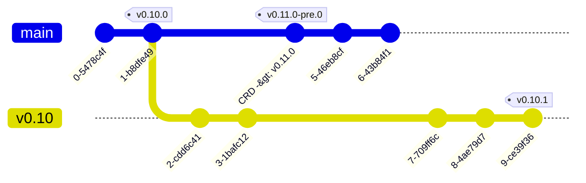

## Tetragon release checklist

- [ ] Check that there are no [release blockers].

- [ ] Set `RELEASE` environment variable. For example, if you are releasing `v0.8.1`:

      export RELEASE=v0.8.1

- [ ] Open a pull request to update the Helm chart and docs version:

      git checkout -b pr/prepare-$RELEASE
      ./contrib/update-helm-chart.sh $RELEASE
      make -C install/kubernetes
      git add install/kubernetes/tetragon/
      # update hugo version
      sed -i "s/^version =.*/version = \"${RELEASE}\"/" docs/hugo.toml
      git add docs/

      git commit -s -m "Prepare for $RELEASE release"
      git push origin HEAD

- [ ] Once the pull request gets merged, create a tag for the release:

      git checkout main
      git pull origin main
      git tag -a $RELEASE -m "$RELEASE release" -s
      git push origin $RELEASE

- If release is `X.Y.0`:

  - [ ] Create `vX.Y` branch.
  - [ ] Create a "Starting `X.Y+1` development" PR on the master branch with the following changes:
    - Update [CustomResourceDefinitionSchemaVersion](https://github.com/cilium/tetragon/blob/6f2809c51b3fbd35b1de0a178f1e3d0b18c52bcc/pkg/k8s/apis/cilium.io/v1alpha1/register.go#L18) to `X.Y+1.0`.
  - [ ] Once PR is merged, tag the first commit in master which is not in the `X.Y` branch as `vX.Y+1.0-pre.0`. The high level view of the status after this tag is shown in the following figure (RELEASE is `v0.10.0` in this example):

- [ ] Go to [Image CI Releases workflow] and wait for the release image build to finish.
      - Get approval for your release build workflow from [a Tetragon maintainer]
      - https://quay.io/repository/cilium/tetragon?tab=tags
      - https://quay.io/repository/cilium/tetragon-operator?tab=tags

- [ ] When a tag is pushed, a GitHub Action job takes care of creating a new GitHub
      draft release, building artifacts and attaching them to the draft release. Once
      the draft is available in the [releases page]:
  - [ ] Use the "Auto-generate release notes" button to generate the release notes.
  - [ ] Review the release notes and click on "Publish Release" at the bottom.

- [ ] Publish Helm chart
      - Follow [cilium/charts RELEASE.md] to publish the Helm chart.
      - Once the pull request is merged and the chart is published, go to [cilium/charts GKE workflow] and wait for the
        CI run to pass.

[hugo docs]: https://github.com/cilium/tetragon/blob/main/docs/hugo.toml
[release blockers]: https://github.com/cilium/tetragon/issues?q=is%3Aissue+is%3Aopen+label%3Arelease-blocker
[Image CI Releases workflow]: https://github.com/cilium/tetragon/actions/workflows/build-images-releases.yml
[cilium/charts RELEASE.md]: https://github.com/cilium/charts/blob/master/RELEASE.md
[cilium/charts GKE workflow]: https://github.com/cilium/charts/actions/workflows/conformance-tetragon-gke.yaml
[releases page]: https://github.com/cilium/tetragon/releases
[a Tetragon maintainer]: https://github.com/orgs/cilium/teams/tetragon-maintainers/members
