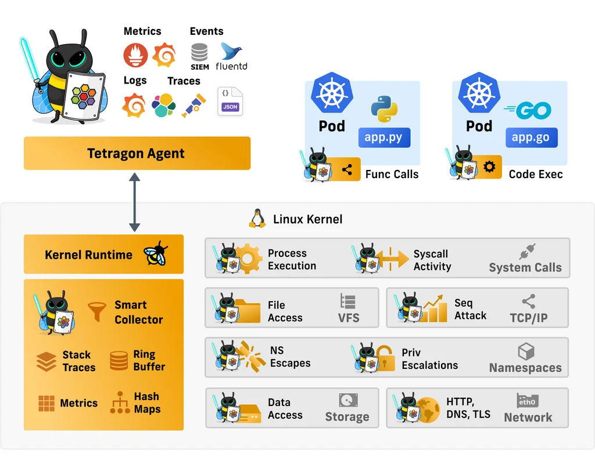

<picture>
  <source media="(prefers-color-scheme: light)" srcset="https://github.com/cilium/tetragon/releases/download/tetragon-cli/logo.png" width="400">
  
</picture>

[](https://opensource.org/licenses/Apache-2.0)

----

Cilium’s new Tetragon component enables powerful realtime, eBPF-based Security Observability and
Runtime Enforcement.

Tetragon detects and is able to react to security-significant events, such as

* Process execution events
* System call activity
* I/O activity including network & file access

When used in a Kubernetes environment, Tetragon is Kubernetes-aware - that is, it understands
Kubernetes identities such as namespaces, pods and so-on - so that security event detection
can be configured in relation to individual workloads.



## Functionality Overview #

### eBPF Real-Time ##

Tetragon is a runtime security enforcement and observability tool. What this means is Tetragon applies
policy and filtering directly in eBPF in the kernel. It performs the filtering,
blocking, and reacting to events directly in the kernel instead of sending
events to a user space agent.

For an observability use case, applying filters directly in the kernel drastically reduces
observation overhead. By avoiding expensive context switching and wake-ups, especially
for high frequency events, such as send, read, or write operations, eBPF reduces required
resources. Instead, Tetragon provides rich filters (file, socket, binary names, namespace/capabilities,
etc.) in eBPF, which allows users to specify the important and relevant events in their
specific context, and pass only those to the user-space agent.

### eBPF Flexibility ##

Tetragon can hook into any function in the Linux kernel and filter on its arguments,
return value, associated metadata that Tetragon collects about processes (e.g., executable
names), files, and other properties. By writing tracing policies users can solve various
security and observability use cases. We provide a number of examples for these in the repository and
highlight some below in the 'Getting Started Guide', but users are encouraged to create new policies that
match their use cases. The examples are just that, jumping off points that users can
then use to create new and specific policy deployments even potentially tracing kernel
functions we did not consider. None of the specifics about which functions are traced
and what filters are applied are hard-coded in the engine itself.

Critically, Tetragon allows hooking deep in the kernel where data structures can not be manipulated
by user space applications avoiding common issues with syscall tracing where
data is incorrectly read, maliciously altered by attackers, or missing due to page
faults and other user/kernel boundary errors.

Many of the Tetragon developers are also kernel developers. By leveraging this knowledge base
Tetragon has created a set of tracing policies that can solve many common observability
and security use cases.

### eBPF Kernel Aware ##

Tetragon, through eBPF, has access to the Linux kernel state. Tetragon can then
join this kernel state with Kubernetes awareness or user policy to create rules
enforced by the kernel in real time. This allows annotating and enforcing process
namespace and capabilities, sockets to processes, process file descriptor to
filenames and so on. For example, when an application changes its privileges we
can create a policy to trigger an alert or even kill the process before it has
a chance to complete the syscall and potentially run additional syscalls.

## Local Development

For getting started with local development, you can refer to the [Development Guide][dev-guide].

[dev-guide]: ./docs/contributing/development/README.md

## Quickstart Guide

This Quickstart guide uses a Kind cluster and a helm-based installation to
provide a simple way to get a hands on experience with Tetragon and
the generated events. These events include monitoring process execution,
network sockets, and file access to see what binaries are executing and making
network connections or writing to sensitive files.

In this scenario, we are going to install a demo application,

* observe all process execution happening inside a Kubernetes workload
* detect file access and writes
* observe network connections that a Kubernetes workload is making
* detect privileged processes inside a Kubernetes workload

While, we use a Kubernetes Kind cluster in this guide, users can also apply
the same concepts in other Kubernetes platforms, bare-metal, or VM environments.

### Requirements

The base kernel should support [BTF](#btf-requirement) or the BTF file should
be placed where Tetragon can read it.

For reference, the examples below use this [Vagrantfile](#btf-requirement) and we
created our [Kind](https://kind.sigs.k8s.io/docs/user/quick-start/) cluster using
the defaults options.

### Create a cluster

Create a Kubernetes cluster using Kind or GKE.

#### Kind

Run the following command to create the Kubernetes cluster:
```
kind create cluster
```

#### GKE

Run the following command to create a GKE cluster:

```
export NAME="$(whoami)-$RANDOM"
gcloud container clusters create "${NAME}" \
  --zone us-west2-a \
  --release-channel rapid \
  --num-nodes 1 
```

### Deploy Tetragon

To install and deploy Tetragon, run the following commands:

```
helm repo add cilium https://helm.cilium.io
helm repo update
helm install tetragon cilium/tetragon -n kube-system
kubectl rollout status -n kube-system ds/tetragon -w
```

By default, kube-system pods are filtered for the examples below we use the demo
deployment from [Cilium](https://docs.cilium.io/en/v1.11/gettingstarted/http/#gs-http)
to generate events.

### Deploy Demo Application

Once Tetragon is installed, you can use our Demo Application to explore
the Security Observability Events:

```bash
kubectl create -f https://raw.githubusercontent.com/cilium/cilium/v1.11/examples/minikube/http-sw-app.yaml
```

Before going forward, verify that all pods are up and running - it might take
several seconds for some pods until they satisfy all the dependencies:

```bash
kubectl get pods
NAME                         READY   STATUS    RESTARTS   AGE
deathstar-6c94dcc57b-7pr8c   1/1     Running   0          10s
deathstar-6c94dcc57b-px2vw   1/1     Running   0          10s
tiefighter                   1/1     Running   0          10s
xwing                        1/1     Running   0          10s
```

### Explore Security Observability Events

After Tetragon and the Demo Application is up and running you can examine
the security and observability events produced by Tetragon in different ways.

#### Raw JSON events

The first way is to observe the raw json output from the stdout container log:

```
kubectl logs -n kube-system ds/tetragon -c export-stdout -f
```

**NOTE**: If you're running more than one `tetragon` pod then the command above will only print the logs from one of those pods. To print out the logs on all `tetragon` pods, you will need to use a filter/selector such as `-l app.kubernetes.io/name=tetragon`:
```
kubectl logs -n kube-system -l app.kubernetes.io/name=tetragon -c export-stdout -f
```

The raw JSON events provide Kubernetes API, identity metadata, and OS
level process visibility about the executed binary, its parent and the execution
time.

#### Tetragon CLI

A second way is to pretty print the events using the
[Tetragon CLI](https://github.com/cilium/tetragon/releases/tag/tetragon-cli).
The tool also allows filtering by process, pod, and other fields.

You can download and install it by the following command:

```
GOOS=$(go env GOOS)
GOARCH=$(go env GOARCH)
curl -L --remote-name-all https://github.com/cilium/tetragon/releases/download/tetragon-cli/tetragon-${GOOS}-${GOARCH}.tar.gz{,.sha256sum}
sha256sum --check tetragon-${GOOS}-${GOARCH}.tar.gz.sha256sum
sudo tar -C /usr/local/bin -xzvf tetragon-${GOOS}-${GOARCH}.tar.gz
rm tetragon-${GOOS}-${GOARCH}.tar.gz{,.sha256sum}
```

(see https://github.com/cilium/tetragon/releases/tag/tetragon-cli for supported `GOOS`/`GOARCH` binary releases)

To start printing events run:

```
kubectl logs -n kube-system ds/tetragon -c export-stdout -f | tetragon observe
```

Tetragon is able to observe several events, here we provide a few small
samples that can be used as a starting point:

### Process Execution ###

This first use case is monitoring process execution, which can be observed with
the Tetragon `process_exec` and `process_exit` JSON events.
These events contain the full lifecycle of processes, from fork/exec to
exit, including metadata such as:

* Binary name: Defines the name of an executable file
* Parent process: Helps to identify process execution anomalies (e.g., if a nodejs app forks a shell, this is suspicious)
* Command-line argument: Defines the program runtime behavior
* Current working directory: Helps to identify hidden malware execution from a temporary folder, which is a common pattern used in malwares
* Kubernetes metadata: Contains pods, labels, and Kubernetes namespaces, which are critical to identify service owners, particularly in a multitenant environments
* exec_id: A unique process identifier that correlates all recorded activity of a process

As a first step, let's start monitoring the events from the `xwing` pod:

```bash
kubectl logs -n kube-system ds/tetragon -c export-stdout -f | tetragon observe --namespace default --pod xwing
```

Then in another terminal, let's `kubectl exec` into the `xwing` pod and execute
some example commands:

```bash
kubectl exec -it xwing -- /bin/bash
whoami
```

If you observe, the output in the first terminal should be:

```bash
🚀 process default/xwing /bin/bash
🚀 process default/xwing /usr/bin/whoami
💥 exit    default/xwing /usr/bin/whoami 0
```

Here you can see the binary names along with its arguments, the pod info, and
return codes. For a compact one line view of the events.

For more details use the raw JSON events to get detailed information, you can stop
the Tetragon CLI by `Crl-C` and parse the `tetragon.log` file by executing:

```bash
kubectl logs -n kube-system ds/tetragon -c export-stdout -f | jq 'select(.process_exec.process.pod.name=="xwing" or .process_exit.process.pod.name=="xwing")'
```

Example `process_exec` and `process_exit` events can be:
<details><summary> Process Exec Event </summary>
<p>

```json
{
  "process_exec": {
    "process": {
      "exec_id": "a2luZC1jb250cm9sLXBsYW5lOjExNDI4NjE1NjM2OTAxOjUxNTgz",
      "pid": 51583,
      "uid": 0,
      "cwd": "/",
      "binary": "/usr/bin/whoami",
      "arguments": "--version",
      "flags": "execve rootcwd clone",
      "start_time": "2022-05-11T12:54:45.615Z",
      "auid": 4294967295,
      "pod": {
        "namespace": "default",
        "name": "xwing",
        "container": {
          "id": "containerd://1fb931d2f6e5e4cfdbaf30fdb8e2fdd81320bdb3047ded50120a4f82838209ce",
          "name": "spaceship",
          "image": {
            "id": "docker.io/tgraf/netperf@sha256:8e86f744bfea165fd4ce68caa05abc96500f40130b857773186401926af7e9e6",
            "name": "docker.io/tgraf/netperf:latest"
          },
          "start_time": "2022-05-11T10:07:33Z",
          "pid": 50
        }
      },
      "docker": "1fb931d2f6e5e4cfdbaf30fdb8e2fdd",
      "parent_exec_id": "a2luZC1jb250cm9sLXBsYW5lOjkwNzkyMjU2MjMyNjk6NDM4NzI=",
      "refcnt": 1
    },
    "parent": {
      "exec_id": "a2luZC1jb250cm9sLXBsYW5lOjkwNzkyMjU2MjMyNjk6NDM4NzI=",
      "pid": 43872,
      "uid": 0,
      "cwd": "/",
      "binary": "/bin/bash",
      "flags": "execve rootcwd clone",
      "start_time": "2022-05-11T12:15:36.225Z",
      "auid": 4294967295,
      "pod": {
        "namespace": "default",
        "name": "xwing",
        "container": {
          "id": "containerd://1fb931d2f6e5e4cfdbaf30fdb8e2fdd81320bdb3047ded50120a4f82838209ce",
          "name": "spaceship",
          "image": {
            "id": "docker.io/tgraf/netperf@sha256:8e86f744bfea165fd4ce68caa05abc96500f40130b857773186401926af7e9e6",
            "name": "docker.io/tgraf/netperf:latest"
          },
          "start_time": "2022-05-11T10:07:33Z",
          "pid": 43
        }
      },
      "docker": "1fb931d2f6e5e4cfdbaf30fdb8e2fdd",
      "parent_exec_id": "a2luZC1jb250cm9sLXBsYW5lOjkwNzkxODU5NTMzOTk6NDM4NjE=",
      "refcnt": 1
    }
  },
  "node_name": "kind-control-plane",
  "time": "2022-05-11T12:54:45.615Z"
}
```

</p>
</details>

<details><summary> Process Exit Event </summary>
<p>

```json
{
  "process_exit": {
    "process": {
      "exec_id": "a2luZC1jb250cm9sLXBsYW5lOjExNDI4NjE1NjM2OTAxOjUxNTgz",
      "pid": 51583,
      "uid": 0,
      "cwd": "/",
      "binary": "/usr/bin/whoami",
      "arguments": "--version",
      "flags": "execve rootcwd clone",
      "start_time": "2022-05-11T12:54:45.615Z",
      "auid": 4294967295,
      "pod": {
        "namespace": "default",
        "name": "xwing",
        "container": {
          "id": "containerd://1fb931d2f6e5e4cfdbaf30fdb8e2fdd81320bdb3047ded50120a4f82838209ce",
          "name": "spaceship",
          "image": {
            "id": "docker.io/tgraf/netperf@sha256:8e86f744bfea165fd4ce68caa05abc96500f40130b857773186401926af7e9e6",
            "name": "docker.io/tgraf/netperf:latest"
          },
          "start_time": "2022-05-11T10:07:33Z",
          "pid": 50
        }
      },
      "docker": "1fb931d2f6e5e4cfdbaf30fdb8e2fdd",
      "parent_exec_id": "a2luZC1jb250cm9sLXBsYW5lOjkwNzkyMjU2MjMyNjk6NDM4NzI="
    },
    "parent": {
      "exec_id": "a2luZC1jb250cm9sLXBsYW5lOjkwNzkyMjU2MjMyNjk6NDM4NzI=",
      "pid": 43872,
      "uid": 0,
      "cwd": "/",
      "binary": "/bin/bash",
      "flags": "execve rootcwd clone",
      "start_time": "2022-05-11T12:15:36.225Z",
      "auid": 4294967295,
      "pod": {
        "namespace": "default",
        "name": "xwing",
        "container": {
          "id": "containerd://1fb931d2f6e5e4cfdbaf30fdb8e2fdd81320bdb3047ded50120a4f82838209ce",
          "name": "spaceship",
          "image": {
            "id": "docker.io/tgraf/netperf@sha256:8e86f744bfea165fd4ce68caa05abc96500f40130b857773186401926af7e9e6",
            "name": "docker.io/tgraf/netperf:latest"
          },
          "start_time": "2022-05-11T10:07:33Z",
          "pid": 43
        }
      },
      "docker": "1fb931d2f6e5e4cfdbaf30fdb8e2fdd",
      "parent_exec_id": "a2luZC1jb250cm9sLXBsYW5lOjkwNzkxODU5NTMzOTk6NDM4NjE="
    }
  },
  "node_name": "kind-control-plane",
  "time": "2022-05-11T12:54:45.616Z"
}
```

</p>
</details>

For the rest of the use cases we will use the Tetragon CLI to give the output.

### File Access

The second use case is file access, which can be observed with the
Tetragon `process_kprobe` JSON events. By using kprobe hook
points, these events are able to observe arbitrary kernel calls and
file descriptors in the Linux kernel, giving you the ability to monitor
every file a process opens, reads, writes, and closes throughout its
lifecycle. To be able to observe arbitrary kernel calls, Tetragon
can be extended with `TracingPolicies`.

`TracingPolicy` is a user-configurable Kubernetes custom resource definition (CRD)
that allows users to trace arbitrary events in the kernel and define actions
to take on a match. For bare metal or VM use cases without Kubernetes a YAML
configuration file can be used.

In this example, we can monitor if a process inside a Kubernetes workload performs
an open, close, read or write in the `/etc/` directory. The policy may further
specify additional directories or specific files if needed.

As a first step, let's apply the following `TracingPolicy`:

```bash
kubectl apply -f https://raw.githubusercontent.com/cilium/tetragon/main/crds/examples/sys_write_follow_fd_prefix.yaml
```

As a second step, let's start monitoring the events from the `xwing` pod:
```bash
kubectl logs -n kube-system ds/tetragon -c export-stdout -f | tetragon observe --namespace default --pod xwing
```

In another terminal, `kubectl exec` into the `xwing` pod:
```bash
kubectl exec -it xwing -- /bin/bash
```
and edit the `/etc/passwd` file:
```bash
vi /etc/passwd
```

If you observe, the output in the first terminal should be:
```bash
🚀 process default/xwing /usr/bin/vi /etc/passwd
📬 open    default/xwing /usr/bin/vi /etc/passwd
📚 read    default/xwing /usr/bin/vi /etc/passwd 1269 bytes
📪 close   default/xwing /usr/bin/vi /etc/passwd
📬 open    default/xwing /usr/bin/vi /etc/passwd
📝 write   default/xwing /usr/bin/vi /etc/passwd 1277 bytes
💥 exit    default/xwing /usr/bin/vi /etc/passwd 0
```

Note, that open and close are only generated for `/etc/` files because of eBPF in kernel
filtering. The default CRD additionally filters events associated with the
pod init process to filter init noise from pod start.

Similarly to the previous example, reviewing the JSON events provides
additional data. An example `process_kprobe` event observing a write can be:

<details><summary> Process Kprobe Event </summary>
<p>

```json
{
   "process_kprobe":{
      "process":{
         "exec_id":"a2luZC1jb250cm9sLXBsYW5lOjE1MDA0MzM3MDE1MDI6MTkxNjM=",
         "pid":19163,
         "uid":0,
         "cwd":"/",
         "binary":"/usr/bin/vi",
         "arguments":"/etc/passwd",
         "flags":"execve rootcwd clone",
         "start_time":"2022-05-26T22:05:13.894Z",
         "auid":4294967295,
         "pod":{
            "namespace":"default",
            "name":"xwing",
            "container":{
               "id":"containerd://4b0df5a137260a6b95cbf6443bb2f4b0c9309e6ccb3d8afdbc3da8fff40c0778",
               "name":"spaceship",
               "image":{
                  "id":"docker.io/tgraf/netperf@sha256:8e86f744bfea165fd4ce68caa05abc96500f40130b857773186401926af7e9e6",
                  "name":"docker.io/tgraf/netperf:latest"
               },
               "start_time":"2022-05-26T21:58:11Z",
               "pid":25
            }
         },
         "docker":"4b0df5a137260a6b95cbf6443bb2f4b",
         "parent_exec_id":"a2luZC1jb250cm9sLXBsYW5lOjEyMDQ1NTIzMTUwNjY6MTc1NDI=",
         "refcnt":1
      },
      "parent":{
         
      },
      "function_name":"__x64_sys_write",
      "args":[
         {
            "file_arg":{
               "path":"/etc/passwd"
            }
         },
         {
            "bytes_arg":"cm9vdDp4OjA6MDpyb290Oi9yb290Oi9iaW4vYXNoCm5hdGFsaWEKYmluOng6MToxOmJpbjovYmluOi9zYmluL25vbG9naW4KZGFlbW9uOng6MjoyOmRhZW1vbjovc2Jpbjovc2Jpbi9ub2xvZ2luCmFkbTp4OjM6NDphZG06L3Zhci9hZG06L3NiaW4vbm9sb2dpbgpscDp4OjQ6NzpscDovdmFyL3Nwb29sL2xwZDovc2Jpbi9ub2xvZ2luCnN5bmM6eDo1OjA6c3luYzovc2JpbjovYmluL3N5bmMKc2h1dGRvd246eDo2OjA6c2h1dGRvd246L3NiaW46L3NiaW4vc2h1dGRvd24KaGFsdDp4Ojc6MDpoYWx0Oi9zYmluOi9zYmluL2hhbHQKbWFpbDp4Ojg6MTI6bWFpbDovdmFyL3Nwb29sL21haWw6L3NiaW4vbm9sb2dpbgpuZXdzOng6OToxMzpuZXdzOi91c3IvbGliL25ld3M6L3NiaW4vbm9sb2dpbgp1dWNwOng6MTA6MTQ6dXVjcDovdmFyL3Nwb29sL3V1Y3BwdWJsaWM6L3NiaW4vbm9sb2dpbgpvcGVyYXRvcjp4OjExOjA6b3BlcmF0b3I6L3Jvb3Q6L2Jpbi9zaAptYW46eDoxMzoxNTptYW46L3Vzci9tYW46L3NiaW4vbm9sb2dpbgpwb3N0bWFzdGVyOng6MTQ6MTI6cG9zdG1hc3RlcjovdmFyL3Nwb29sL21haWw6L3NiaW4vbm9sb2dpbgpjcm9uOng6MTY6MTY6Y3JvbjovdmFyL3Nwb29sL2Nyb246L3NiaW4vbm9sb2dpbgpmdHA6eDoyMToyMTo6L3Zhci9saWIvZnRwOi9zYmluL25vbG9naW4Kc3NoZDp4OjIyOjIyOnNzaGQ6L2Rldi9udWxsOi9zYmluL25vbG9naW4KYXQ6eDoyNToyNTphdDovdmFyL3Nwb29sL2Nyb24vYXRqb2JzOi9zYmluL25vbG9naW4Kc3F1aWQ6eDozMTozMTpTcXVpZDovdmFyL2NhY2hlL3NxdWlkOi9zYmluL25vbG9naW4KeGZzOng6MzM6MzM6WCBGb250IFNlcnZlcjovZXRjL1gxMS9mczovc2Jpbi9ub2xvZ2luCmdhbWVzOng6MzU6MzU6Z2FtZXM6L3Vzci9nYW1lczovc2Jpbi9ub2xvZ2luCnBvc3RncmVzOng6NzA6NzA6Oi92YXIvbGliL3Bvc3RncmVzcWw6L2Jpbi9zaApudXQ6eDo4NDo4NDpudXQ6L3Zhci9zdGF0ZS9udXQ6L3NiaW4vbm9sb2dpbgpjeXJ1czp4Ojg1OjEyOjovdXNyL2N5cnVzOi9zYmluL25vbG9naW4KdnBvcG1haWw6eDo4OTo4OTo6L3Zhci92cG9wbWFpbDovc2Jpbi9ub2xvZ2luCm50cDp4OjEyMzoxMjM6TlRQOi92YXIvZW1wdHk6L3NiaW4vbm9sb2dpbgpzbW1zcDp4OjIwOToyMDk6c21tc3A6L3Zhci9zcG9vbC9tcXVldWU6L3NiaW4vbm9sb2dpbgpndWVzdDp4OjQwNToxMDA6Z3Vlc3Q6L2Rldi9udWxsOi9zYmluL25vbG9naW4Kbm9ib2R5Ong6NjU1MzQ6NjU1MzQ6bm9ib2R5Oi86L3NiaW4vbm9sb2dpbgo="
         },
         {
            "size_arg":"1277"
         }
      ],
      "action":"KPROBE_ACTION_POST"
   },
   "node_name":"kind-control-plane",
   "time":"2022-05-26T22:05:25.962Z"
}
```

</p></details>

In addition to the Kubernetes Identity
and process metadata from exec events, `process_kprobe` events contain
the arguments of the observed system call. In the above case they are

* `path`: the observed file path
* `bytes_arg`: content of the observed file encoded in base64
* `size_arg`: size of the observed file in bytes

To disable the `TracingPolicy` run:

```bash
kubectl delete -f ./crds/examples/sys_write_follow_fd_prefix.yaml
```

### Network Observability

To view TCP connect events apply the example TCP connect `TracingPolicy`:

```bash
kubectl apply -f https://raw.githubusercontent.com/cilium/tetragon/main/crds/examples/tcp-connect.yaml
```

To start monitoring events in the `xwing` pod run the Tetragon CLI:

```bash
kubectl logs -n kube-system ds/tetragon -c export-stdout -f | tetragon observe --namespace default --pod xwing
```

In another terminal, start generate a TCP connection. Here we use
curl.
```bash
kubectl exec -it xwing -- curl http://cilium.io
```
The output in the first terminal will capture the new connect and write,
```bash
🚀 process default/xwing /usr/bin/curl http://cilium.io
🔌 connect default/xwing /usr/bin/curl tcp 10.244.0.6:34965 -> 104.198.14.52:80
📤 sendmsg default/xwing /usr/bin/curl tcp 10.244.0.6:34965 -> 104.198.14.52:80 bytes 73
🧹 close   default/xwing /usr/bin/curl tcp 10.244.0.6:34965 -> 104.198.14.52:80
💥 exit    default/xwing /usr/bin/curl http://cilium.io 0
```

To disable the TracingPolicy run:
```bash
kubectl delete -f ./crds/examples/tcp-connect.yaml
```

### Privileged Execution

Tetragon also provides the ability to check process capabilities and kernel namespaces.

As a first step let's enable visibility to capability and namespace changes via the configmap
by setting `enable-process-cred` and `enable-process-ns`  from `false` to `true`
```bash
kubectl edit cm -n kube-system tetragon-config
# change "enable-process-cred" from "false" to "true"
# change "enable-process-ns" from "false" to "true"
# then save and exit
```
Restart the Tetragon daemonset:
```
kubectl rollout restart -n kube-system ds/tetragon
```

As a second step, let's start monitoring the Security Observability events from the privileged `test-pod` workload:
```bash
kubectl logs -n kube-system ds/tetragon -c export-stdout -f | tetragon observe --namespace default --pod test-pod
```

In another terminal let's apply the privileged PodSpec:
```bash
kubectl apply -f https://raw.githubusercontent.com/cilium/tetragon/main/testdata/specs/testpod.yaml
```

If you observe the output in the first terminal, you can see the container start with `CAP_SYS_ADMIN`:
```bash
🚀 process default/test-pod /bin/sleep 365d                🛑 CAP_SYS_ADMIN
🚀 process default/test-pod /usr/bin/jq -r .bundle         🛑 CAP_SYS_ADMIN
🚀 process default/test-pod /usr/bin/cp /kind/product_name /kind/product_uuid /run/containerd/io.containerd.runtime.v2.task/k8s.io/7c7e513cd4d506417bc9d97dd9af670d94d9e84161c8c8 fdc9fa3a678289a59/rootfs/ 🛑 CAP_SYS_ADMIN
```

## BTF Requirement 

Tetragon repository provides a [Vagrantfile](Vagrantfile) that can
be use to install a vagrant box for running Tetragon with BTF requirement. Other VM solutions
work as well and many common Linux distributions now ship with BTF and do not require any
extra work. To check if BTF is enabled on your Linux system check for the BTF file
in the standard location,

```
$ ls /sys/kernel/btf/
```

To run with [vagrant](https://learn.hashicorp.com/tutorials/vagrant/getting-started-index?in=vagrant/getting-started)
we provide a standard VagrantFile with the required components enabled. Simply run,

```
 $ vagrant up
 $ vagrant ssh
 ```

This should be sufficient to create a Kind cluster and run Tetragon.

# Additional Resources

### Conference talks

[Uncovering a Sophisticated Kubernetes Attack in Real-Time](https://www.youtube.com/watch?v=bohnofE_dvw) - Jed Salazar & Natália Réka Ivánkó, KubeCon EU, 2020 

[Uncovering a Sophisticated Kubernetes Attack in Real Time Part II.](https://www.oreilly.com/library/view/infrastructure-ops/0636920625377/video335775.html) - Jed Salazar & Natália Réka Ivánkó, O'Reilly Superstream Series, Infrastructure & Ops, 2021

[Keeping your cluster safe from attacks with eBPF](https://www.youtube.com/watch?v=agN68U8x1go) - Jed Salazar & Natália Réka Ivánkó, eBPF Summit, 2021

### Book

[Security Observability with eBPF](https://isovalent.com/ebpf-security/) - Jed Salazar & Natália Réka Ivánkó, OReilly, 2022

### Blog posts

[Detecting a Container Escape with Cilium and eBPF](https://isovalent.com/blog/post/2021-11-container-escape) - Natália Réka Ivánkó, 2021

[Detecting and Blocking log4shell with Isovalent Cilium Enterprise](https://isovalent.com/blog/post/2021-12-log4shell) - Jed Salazar, 2021

### Hands-on lab

[Security Observability with eBPF and Tetragon](https://isovalent.com/labs/) - Natália Réka Ivánkó, Roland Wolters, Raphaël Pinson

# Community

## Slack

Join the Tetragon [Slack channel](https://cilium.herokuapp.com/) to chat with developers, maintainers, and other users. This
is a good first stop to ask questions and share your experiences.
