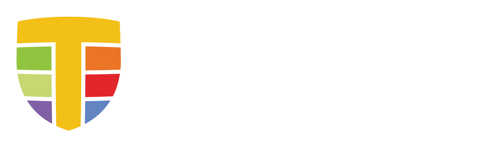

<a href="https://tetragon.io">
  <picture>
    <source media="(prefers-color-scheme: light)" srcset="docs/assets/icons/logo.svg" width="400">
    
  </picture>
</a>

---

Cilium’s new [Tetragon](https://tetragon.io) component enables powerful
real-time, eBPF-based Security Observability and Runtime Enforcement.

Tetragon detects and is able to react to security-significant events, such as

- Process execution events
- System call activity
- I/O activity including network & file access

When used in a Kubernetes environment, Tetragon is Kubernetes-aware - that is,
it understands Kubernetes identities such as namespaces, pods and so on - so
that security event detection can be configured in relation to individual
workloads.

See more about [how Tetragon is using eBPF](https://tetragon.io/docs/overview#functionality-overview).

## Getting started

Refer to the [official documentation of Tetragon](https://tetragon.io/docs/).

To get started with Tetragon, take a look at the [getting started
guides](https://tetragon.io/docs/getting-started/) to:
- [Try Tetragon on Kubernetes](https://tetragon.io/docs/getting-started/install-k8s/)
- [Try Tetragon on Linux](https://tetragon.io/docs/getting-started/install-docker/)
- [Deploy Tetragon](https://tetragon.io/docs/installation/)
- [Install the Tetra CLI](https://tetragon.io/docs/installation/tetra-cli/)

Tetragon is able to observe critical hooks in the kernel through its sensors
and generates events enriched with Linux and Kubernetes metadata:
1. **Process lifecycle**: generating `process_exec` and `process_exit` events
   by default, enabling full process lifecycle observability. Learn more about
   these events on the [process lifecycle use case page](https://tetragon.io/docs/use-cases/process-lifecycle/).
1. **Generic tracing**: generating `process_kprobe`, `process_tracepoint` and
   `process_uprobe` events for more advanced and custom use cases. Learn more
   about these events on the [TracingPolicy concept page](https://tetragon.io/docs/concepts/tracing-policy/)
   and discover [multiple use cases](https://tetragon.io/docs/use-cases/) like:
   - [🌏 network observability](https://tetragon.io/docs/use-cases/network-observability/)
   - [📂 filename access](https://tetragon.io/docs/use-cases/filename-access/)
   - [🔑 credentials monitoring](https://tetragon.io/docs/use-cases/linux-process-credentials/)
   - [🔓 privileged execution](https://tetragon.io/docs/use-cases/process-lifecycle/privileged-execution/)

See further resources:
- [Conference Talks, Books, Blog Posts, and Labs](https://tetragon.io/docs/resources/)
- [Frequently Asked Question](https://tetragon.io/docs/installation/faq/)
- [References](https://tetragon.io/docs/reference/)

## Join the community

Join the Tetragon [💬 Slack channel](https://slack.cilium.io) and the
[📅 Community Call](https://isogo.to/tetragon-meeting-notes) to chat with
developers, maintainers, and other users. This is a good first stop to ask
questions and share your experiences.

## How to Contribute

For getting started with local development, you can refer to the
[Contribution Guide](https://tetragon.io/docs/contribution-guide/). If
you plan to submit a PR, please ["sign-off"](https://tetragon.io/docs/contribution-guide/developer-certificate-of-origin/)
your commits.
